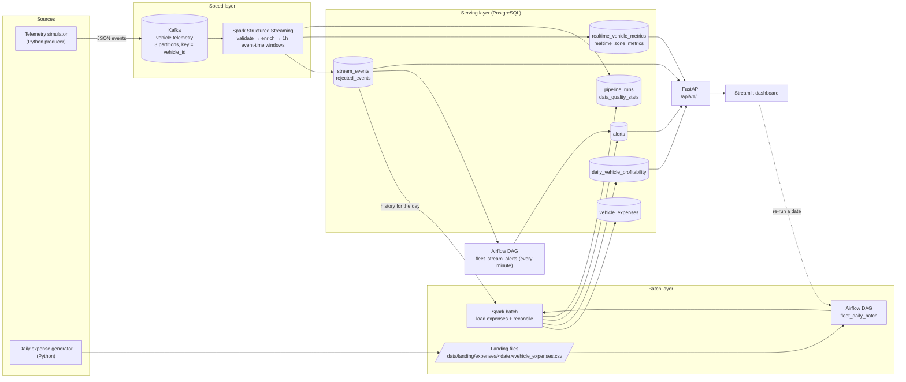

# Architecture

## 1. Problem

A ride-hailing operator wants to know, **in near real time**, how its fleet is being
used (active vs idle vehicles, trips, earnings by zone) and, **once per day**, whether
each vehicle actually made money after fuel and maintenance costs.

Telemetry arrives continuously; costs arrive as a daily file from a separate expense
system. The two must be reconciled per vehicle and business day.

**Business question:** *Which vehicles are under-utilised or unprofitable, and where
and when is the fleet earning money?*

## 2. Lambda Architecture



| Layer | Path | Latency | Output |
|---|---|---|---|
| Speed | Producer → Kafka → Spark Structured Streaming → PostgreSQL | seconds | `stream_events`, `realtime_*_metrics` |
| Batch | Expense file → Airflow → Spark batch → PostgreSQL | once per simulated day | `vehicle_expenses`, `daily_vehicle_profitability` |
| Serving | PostgreSQL → FastAPI | on request | JSON API |

The batch layer recomputes the authoritative daily view from the **full stored event
history** (`stream_events`) plus the expense file, so any approximation in the speed
layer (e.g. approximate distinct counts, late events dropped by the watermark) is
corrected in the daily report.

## 3. Lambda vs Kappa

| | Lambda (chosen) | Kappa |
|---|---|---|
| Idea | Separate speed and batch paths, merged in a serving layer | One streaming path; reprocess by replaying the log |
| Fits a daily **file** source | Naturally — files are batch data | Needs the file turned into a stream first |
| Correcting speed-layer approximations | Batch recomputes from full history | Must replay Kafka with long retention |
| Complexity | Two code paths | One code path |

**Decision: Lambda.** The expense data genuinely arrives as a daily file from another
system, and the business asks for a daily, auditable profitability report — a classic
batch requirement. Real-time utilisation is a classic streaming requirement. Lambda
maps one-to-one onto these two needs. The main cost of Lambda — duplicated logic — is
limited here because the two paths compute *different* things (windowed live metrics vs
daily per-vehicle reconciliation) and share validation rules and constants through
`fleet/common/contracts.py`.

## 4. Technology stack

| Need | Choice | Why |
|---|---|---|
| Event log | **Apache Kafka** (single broker, KRaft, no ZooKeeper) | Partitioned, durable, replayable; KRaft keeps it to one container |
| Stream processing | **Spark Structured Streaming** | Event-time windows + watermarks, exactly-once checkpoints, same engine as batch |
| Batch processing | **Spark (batch)** | Same DataFrame API as streaming; scales beyond one machine if needed |
| Orchestration | **Apache Airflow** | File sensor, retries, run history and task logs in a UI |
| Storage / serving | **PostgreSQL** | Constraints for idempotent upserts, SQL for the API, one small container |
| API | **FastAPI** + Pydantic | Typed response models, automatic OpenAPI docs |
| Dashboard | **Streamlit** | A multi-page data UI in plain Python, no front-end build |
| Packaging | **Docker Compose** | Whole system reproducible with one command |
| Quality | **pytest**, **Ruff** | Tests and lint/format |

Deliberately **not** used: ZooKeeper, Schema Registry, a Spark master/worker cluster,
Celery/Redis for Airflow, Kafka UI. The target machine has ~7 GB RAM; Spark runs in
`local[*]` mode and Airflow uses the `LocalExecutor`.

## 5. Key design decisions (contracts)

### 5.1 Simulated time
`1 simulated day = 300 real seconds` → speed-up factor **288**. The producer owns the
only `SimClock` (`fleet/common/simclock.py`); every other component derives simulated
time from event timestamps in the data. Four timestamps are kept separate:
`event_timestamp` (simulated), `business_date` (UTC date of event timestamp),
`ingestion_ts` (Kafka record time, real), `processing_ts` (Spark, real).

With `STREAM_INTERVAL_SECONDS=1` each vehicle emits one event per real second =
one event every **4.8 simulated minutes**, i.e. **300 events per vehicle per day**.

### 5.2 Event semantics
See `fleet/common/contracts.py`. A trip's total fare is reported **once**, on the last
`on_trip` event; all other events have `fare = 0`. So `earnings = SUM(fare)`,
`trips = COUNT(fare > 0)`, `avg_fare = AVG(fare | fare > 0)` in both layers.

### 5.3 Kafka
Topic `vehicle.telemetry`, 3 partitions, key = `vehicle_id` → all events of a vehicle go
to the same partition, preserving per-vehicle order. JSON values. Producer uses
`acks=all`, idempotence, retries and a delivery callback.

### 5.4 Streaming
Three queries over the same Kafka source:
1. **ingest**: parse + validate → valid rows to `stream_events` (idempotent on `event_id`),
   invalid rows to `rejected_events`, counts to `data_quality_stats`.
2. **fleet metrics**: 1-hour (simulated) tumbling windows, 15-minute watermark →
   `realtime_vehicle_metrics` (upsert on `window_start`).
3. **zone metrics**: same windows grouped by zone → `realtime_zone_metrics`.

`idle_ratio = idle events / all events` in the window. Because every vehicle reports
at a fixed cadence, the share of events equals the share of time spent idle.

### 5.5 Batch and reconciliation
DAG `fleet_daily_batch`: wait for file → validate → Spark batch loads
`vehicle_expenses` → Spark batch reconciles with `stream_events` for that date →
`daily_vehicle_profitability` → profitability alerts. Idempotency: rows keyed by
`(vehicle_id, business_date)`; a re-run for a date replaces that date's rows inside one
transaction.

```
trips                = COUNT(events with fare > 0)
earnings             = SUM(fare)
total_operating_cost = fuel_cost + maintenance_cost
estimated_profit     = earnings - fuel_cost - maintenance_cost
utilization_rate     = on_trip_events / all_events          (0..1, time share on paid trips)
profitability_status = profitable   if estimated_profit >= PROFITABLE_MIN_PROFIT
                       watch        if estimated_profit >= WATCH_MIN_PROFIT
                       unprofitable otherwise
```

### 5.6 Alerts
Stored in `alerts`, de-duplicated by `dedup_key`.
- `no_stream_data`: no event ingested for `ALERT_NO_DATA_SECONDS` real seconds (DAG `fleet_stream_alerts`). Auto-resolves when data resumes.
- `vehicle_idle`: vehicle idle for `ALERT_IDLE_MINUTES` (default 240) simulated minutes, measured against the latest fleet event time (DAG `fleet_stream_alerts`). Auto-resolves when the vehicle moves.
- `low_profitability`: `estimated_profit < ALERT_MIN_DAILY_PROFIT` (DAG `fleet_daily_batch`).

## 6. Code layout

```
fleet/common/     config, contracts, zones, simclock, JSON logging, db helper
fleet/producer/   telemetry simulator + Kafka producer
fleet/streaming/  Spark Structured Streaming job + transforms + event validation
fleet/batch/      expense generator, validation, Spark batch job, reconciliation
fleet/alerts/     alert rules + evaluator
fleet/api/        FastAPI app, Pydantic schemas, repository (SQL)
fleet/dashboard/  Streamlit dashboard: API client, Airflow REST client, pages
airflow/dags/     fleet_daily_batch, fleet_stream_alerts
sql/              database schema (runs on first PostgreSQL start)
docker/           Dockerfiles
tests/unit        fast tests, no services
tests/integration tests against running Docker services
```
