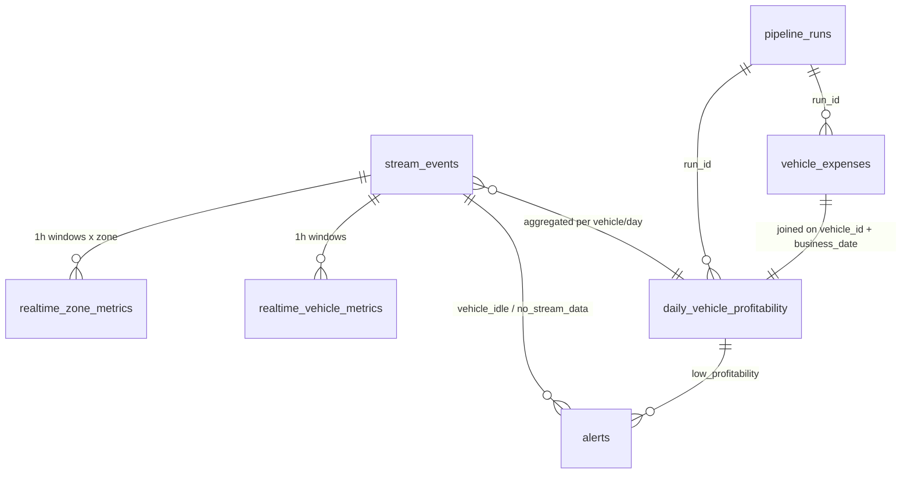

# Data Model

All tables live in the PostgreSQL database `fleet` and are created by
[`sql/001_schema.sql`](../sql/001_schema.sql) on the first start of an empty volume.
Money is LKR (Sri Lankan rupees), distance km, speed km/h. Timestamps are stored in
UTC; business dates are Sri Lankan calendar dates (Asia/Colombo, UTC+05:30).

## Time columns

| Column | Clock | Set by | Meaning |
|---|---|---|---|
| `event_timestamp` | simulated | producer | when the event happened in the simulation |
| `business_date` | simulated | Spark | Sri Lankan (Asia/Colombo) date of `event_timestamp` |
| `ingestion_ts` | real | Kafka | Kafka record timestamp (CreateTime: when the producer sent it) |
| `processing_ts` | real | Spark | when the streaming job processed the record |

1 simulated day = 300 real seconds (speed-up 288×).

## Entity overview

## Speed layer

### `stream_events` — validated telemetry (history for the batch layer)
| Column | Type | Notes |
|---|---|---|
| `event_id` | UUID **PK** | replays are ignored (`ON CONFLICT DO NOTHING`) |
| `trip_id` | text | NULL while idle |
| `driver_id`, `vehicle_id` | text | `D###`, `V###` |
| `latitude`, `longitude` | double | CHECK valid range |
| `speed` | double | CHECK ≥ 0 |
| `status` | text | CHECK in `idle`, `enroute`, `on_trip` |
| `fare` | numeric(10,2) | CHECK ≥ 0; > 0 only on a trip's final `on_trip` event |
| `event_timestamp`, `business_date` | timestamptz, date | simulated |
| `zone` | text | 3×3 grid over the city, or `outside` |
| `kafka_partition`, `kafka_offset` | int, bigint | lineage back to Kafka |
| `ingestion_ts`, `processing_ts` | timestamptz | real |

Indexes: `(business_date, vehicle_id)` for reconciliation, `(vehicle_id, event_timestamp DESC)` for
the vehicle API and idle alerts, `(ingestion_ts DESC)` for the no-data alert.

### `rejected_events` — quarantine
Raw Kafka value, reason codes (e.g. `malformed_json`, `invalid_status`), partition/offset
(**unique**, so a replay does not duplicate), ingestion and processing time.

### `realtime_vehicle_metrics` — fleet-level 1-hour event-time windows
PK `window_start`. Columns: `window_end`, `business_date`, `vehicles_reporting`,
`active_vehicles`, `idle_vehicles`, `event_count`, `idle_event_count`, `idle_ratio`,
`trips_completed`, `total_earnings`, `avg_fare`, `updated_at`. Upserted on every micro-batch
until the watermark closes the window.

### `realtime_zone_metrics` — the same per zone
PK `(window_start, zone)`. Earnings are attributed to the zone of the fare event (drop-off).

## Batch layer

### `vehicle_expenses` — loaded from the daily file
PK `(vehicle_id, business_date)`. `fuel_cost`, `maintenance_cost`, `distance_covered`
(odometer, all CHECK ≥ 0), `service_flag`, `source_file`, `run_id` → `pipeline_runs`, `loaded_at`.

### `daily_vehicle_profitability` — reconciliation result (serving table for the daily report)
PK `(vehicle_id, business_date)`.

| Column | Definition |
|---|---|
| `trips` | `COUNT(events with fare > 0)` |
| `event_count`, `on_trip_event_count` | from `stream_events` |
| `stream_distance_km` | Σ speed × time since the vehicle's previous event (gaps > 30 sim-min ignored) |
| `distance_km` | odometer distance from the expense file |
| `earnings` | `SUM(fare)` |
| `fuel_cost`, `maintenance_cost` | from `vehicle_expenses` |
| `total_operating_cost` | `fuel_cost + maintenance_cost` |
| `estimated_profit` | `earnings − fuel_cost − maintenance_cost` |
| `utilization_rate` | `on_trip_event_count / event_count` (0..1) |
| `service_flag` | from `vehicle_expenses` |
| `profitability_status` | `profitable` ≥ `PROFITABLE_MIN_PROFIT` (LKR 2,500) > `watch` ≥ `WATCH_MIN_PROFIT` (0) > `unprofitable` |

## Operational tables

### `pipeline_runs`
One row per batch job execution (`expenses_validation`, `expenses_load`, `reconciliation`):
`status` running → success | failed, `rows_read`, `rows_written`, `rows_rejected`,
`error_message`, `airflow_run_id`, start/finish times.

### `data_quality_stats`
One row per streaming micro-batch (`stream_ingest`) and per validated batch file:
`records_total`, `records_valid`, `records_rejected`, `rule_failures` (JSON counts per rule).

### `alerts`
`alert_id`, `alert_type` (`no_stream_data`, `vehicle_idle`, `low_profitability`), `severity`
(`info`, `warning`, `critical`), `vehicle_id` (NULL for fleet-wide), `business_date`,
`created_at`, `message`, `status` (`open`, `resolved`), `resolved_at`, and a **unique
`dedup_key`** so the same condition is never raised twice.

## Idempotency summary

| Table | Mechanism |
|---|---|
| `stream_events` | PK `event_id`, insert-or-ignore |
| `rejected_events` | unique `(kafka_partition, kafka_offset)` |
| `realtime_*_metrics` | upsert on window key |
| `vehicle_expenses`, `daily_vehicle_profitability` | replace the whole business date in one transaction (staging table swap) |
| `data_quality_stats` (stream) | delete-and-insert by Kafka offset range |
| `alerts` | unique `dedup_key` |
